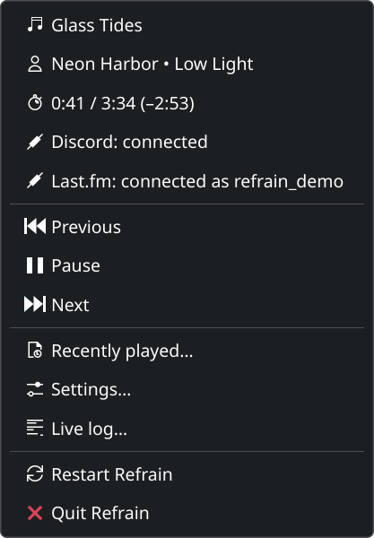
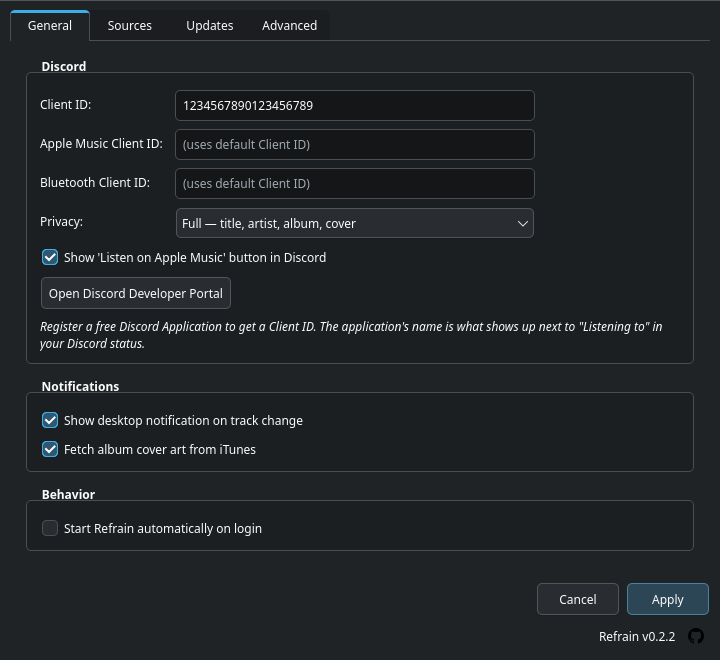
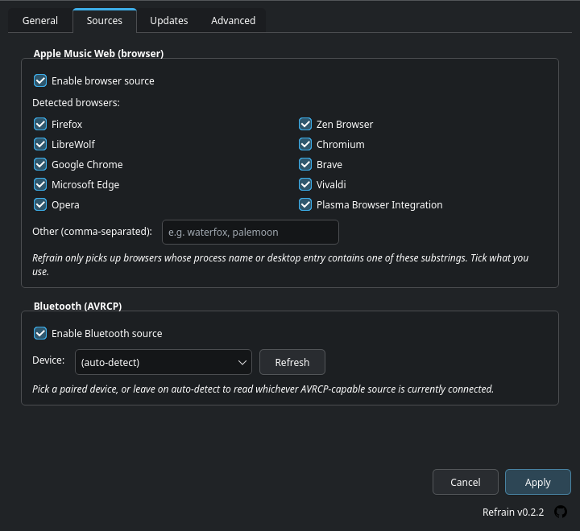
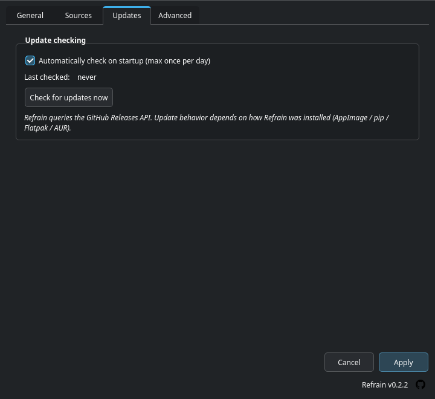
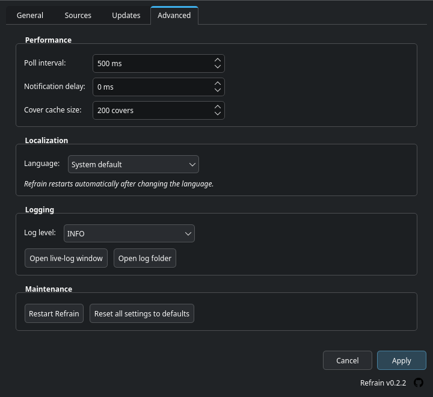
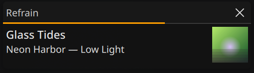
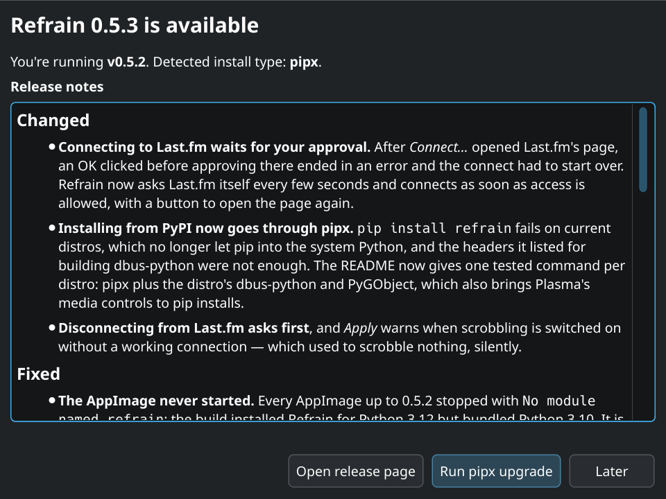
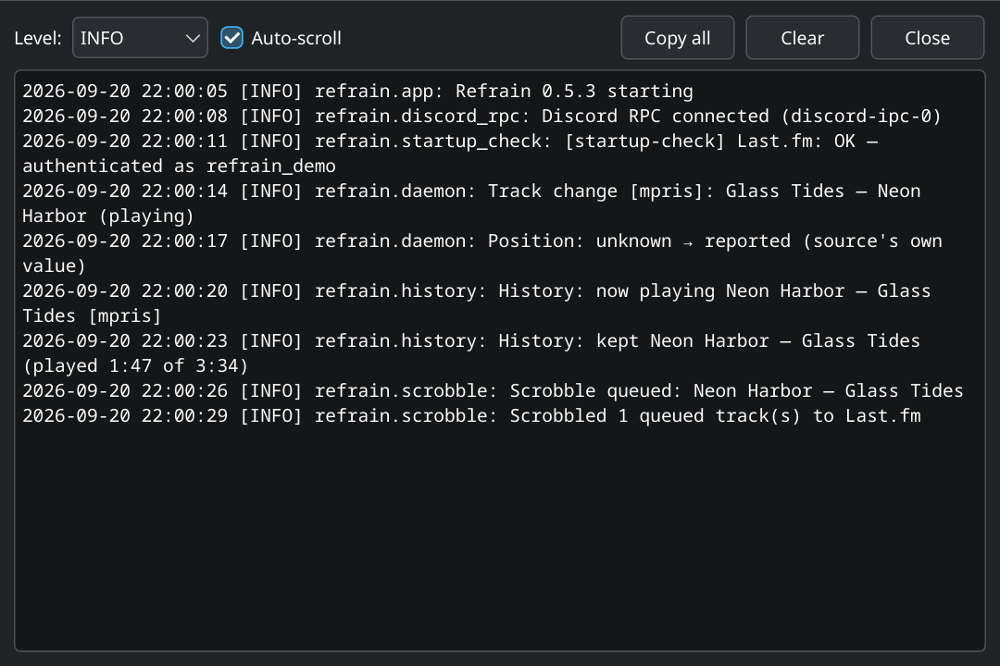

# Refrain

**Discord Rich Presence for Apple Music on Linux.**

[](https://github.com/Rockykln/refrain/actions/workflows/tests.yml)
[](https://github.com/Rockykln/refrain/actions/workflows/codeql.yml)
[](https://github.com/Rockykln/refrain/actions/workflows/security.yml)
[](#requirements)
[](LICENSE)

Refrain shows what you're listening to on Apple Music as your Discord status
— whether the audio is playing in a browser tab on `music.apple.com` or
streaming from your iPhone over Bluetooth.

<p align="center">
  
</p>

## What it does

- Reads playback metadata from **MPRIS** (Apple Music in any major Linux
  browser) and **BlueZ AVRCP** (any AVRCP-capable Bluetooth source).
- Forwards track + cover art to Discord via the local IPC socket.
- Lives in your **system tray** with Play/Pause/Next/Previous controls.
- Provides a **settings window** (PySide6) for everything users typically want
  to tweak — privacy mode, sources, autostart, Bluetooth device picker.

```
        ┌─────────────────────────────────────────────────────────┐
        │   Refrain                                               │
        │                                                         │
        │   ┌──────────┐    ┌──────────┐    ┌────────────────┐    │
        │   │  MPRIS   │    │  BlueZ   │    │     Tray +     │    │
        │   │  source  │    │  AVRCP   │    │  Settings UI   │    │
        │   └────┬─────┘    └────┬─────┘    └───────┬────────┘    │
        │        │               │                  │             │
        │        ▼               ▼                  ▼             │
        │   ┌─────────────────────────────────────────────┐       │
        │   │             Background daemon               │       │
        │   └────────────────────┬────────────────────────┘       │
        │                        │                                │
        │                        ▼                                │
        │           Discord Rich Presence (IPC)                   │
        └─────────────────────────────────────────────────────────┘
```

## Requirements

- Linux with D-Bus
- **Python ≥ 3.11**
- Discord desktop client running (Refrain talks to its IPC socket)
- For Bluetooth: BlueZ with AVRCP enabled

## Install

| Channel | Install |
|---------|---------|
| **PyPI** *(any distro with Python ≥ 3.11)* | `pip install refrain` |
| **AUR** *(Arch / CachyOS / Manjaro / EndeavourOS)* | `yay -S refrain` *(stable)* or `yay -S refrain-git` *(latest main)* |
| **AppImage** *(portable single-file, any glibc-based distro)* | Download from the [Releases page](https://github.com/Rockykln/refrain/releases/latest) |
| **From source** | See below |

A Flatpak manifest exists under `packaging/flatpak/` for users who want to
build it themselves; a Flathub submission is on the roadmap but not
currently active. Build files for the live channels live under
[`packaging/`](packaging/).
See [`packaging/README.md`](packaging/README.md) for build instructions.

### From source (development)

```sh
git clone https://github.com/Rockykln/refrain.git
cd refrain

# On distros that already package Qt-for-Python and dbus-python (Arch, Fedora,
# openSUSE …) a venv with --system-site-packages avoids re-downloading them.
python -m venv --system-site-packages .venv
source .venv/bin/activate

pip install -e .
refrain
```

If your distro doesn't ship `PySide6` or `dbus-python`, plain
`python -m venv .venv` works too — pip will pull `PySide6` from PyPI and
build `dbus-python` against your system's D-Bus headers
(`libdbus-1-dev` on Debian/Ubuntu, `dbus-devel` on Fedora).

### Pip-installed users: get a launcher

When installed via `pip` rather than a distro package, Refrain doesn't
register itself with your application menu. Run once after install:

```sh
refrain --install-desktop
```

This copies the `.desktop` file and icon to `~/.local/share/applications/`
and `~/.local/share/icons/`. To undo: `refrain --uninstall-desktop`.

### Tested on

- KDE Plasma 6 (Wayland) — primary target
- KDE Plasma 6 (X11)
- GNOME (with the [AppIndicator and KStatusNotifierItem](https://extensions.gnome.org/extension/615/appindicator-support/) extension)

## First-time setup

Refrain needs a Discord Application ID to push status updates. Each user
registers their own (free, takes 30 seconds):

1. Open <https://discord.com/developers/applications> and click **New Application**.
2. Name it whatever you want — that name is what shows up under
   *"Listening to ..."* in your Discord status. You can also upload a
   square image as the application icon; Discord uses it as the
   fallback when there's no album cover.
3. Copy the **Application ID** from the *General Information* page.
4. Launch Refrain → *Settings → General → Discord Client ID* → paste,
   *Apply*.

That's it. The status will appear in Discord on the next track change.

## Configuration

Settings live at `$XDG_CONFIG_HOME/refrain/config.toml`
(typically `~/.config/refrain/config.toml`). The settings window edits the
same file; you almost never need to touch it by hand.

```toml
[discord]
client_id = ""                     # default Application ID — paste yours here
client_id_mpris = ""               # optional per-source override (browser / Apple Music)
client_id_bluetooth = ""           # optional per-source override (Bluetooth headphones)

[sources]
mpris_enabled = true
bluetooth_enabled = true
bluetooth_device = ""              # empty = auto-detect, or "AA:BB:CC:DD:EE:FF"

[privacy]
mode = "full"                      # "full" | "minimal" | "off"

[behavior]
autostart = false
notifications = true
cover_art = true
show_buttons = true
notify_delay_ms = 0                # 0 = fire ASAP; the cover-art retry loop still waits up to ~2 s

[advanced]
poll_interval_ms = 500
log_level = "INFO"
cover_cache_size = 200             # disk cap for cached covers
idle_grace_s = 30                  # clear status when same track plays past duration + grace; 0 disables
language = "system"                # "system" follows QLocale; "en" / "de" / … force a translation
```

Per-source `client_id_*` fields let Apple Music render under one Discord
application (with the album-grid as artwork) and Bluetooth headphones under
another (with a generic Bluetooth glyph). Empty falls back to the default
`client_id`.

## MPRIS server

Refrain publishes itself as `org.mpris.MediaPlayer2.refrain` on the session
bus, so KDE Plasma's panel media-controls applet (and KDE Connect, GNOME
Shell, Mako, …) drive the same Play/Pause/Next/Previous as the tray and
render the same track Discord renders.

## Tray

<p align="center">
  
</p>

| Item              | What it does                                              |
|-------------------|-----------------------------------------------------------|
| ♪ Title           | Currently playing track (read-only)                       |
| Artist • Album    | Currently playing artist + album (read-only)              |
| ⏱ X:XX / Y:YY     | Elapsed time / track length (and remaining)               |
| ⏮ Previous        | Skip backward on the active source                        |
| ⏵ Play / ⏸ Pause  | Toggle on the active source (label follows playback state)|
| ⏭ Next            | Skip forward on the active source                         |
| ⬆ Update available| Only visible when a newer release exists                  |
| Settings…         | Open the settings window                                  |
| Live log…         | Open the live-log window                                  |
| ⟳ Restart Refrain | Cleanly stop and re-launch (release D-Bus name + RPC, exec the same binary) |
| Quit Refrain      | Stop the daemon and exit                                  |

## Settings

The settings window opens on first launch, and again any time you click
*Settings…* from the tray. Hitting **Apply** writes the change to
`config.toml`, hides the window, and keeps the daemon + tray running in
the background.

<table>
  <tr>
    <td align="center">
      <b>General</b><br/>
      
      <br/><sub>Discord client ID, privacy, autostart, notifications, cover art</sub>
    </td>
    <td align="center">
      <b>Sources</b><br/>
      
      <br/><sub>MPRIS / Bluetooth toggles + paired-device picker</sub>
    </td>
  </tr>
  <tr>
    <td align="center">
      <b>Updates</b><br/>
      
      <br/><sub>Auto-check, last-checked, manual <i>Check for updates now</i></sub>
    </td>
    <td align="center">
      <b>Advanced</b><br/>
      
      <br/><sub>Poll interval, notification delay, cover cache size, log level, live-log, restart</sub>
    </td>
  </tr>
</table>

## Notifications

When a track changes, Refrain fires a desktop notification with the album
cover, song title, artist and album — the same data that's going to your
Discord status. Toggle off in *Settings → General* if you don't want them.

<p align="center">
  
</p>

## Updates

Refrain checks the [GitHub Releases API](https://api.github.com/repos/Rockykln/refrain/releases/latest)
once per day on startup. When a newer version exists, the tray menu shows
an *Update available* item that opens this dialog:

<p align="center">
  
</p>

Behavior is install-type-aware:

- **AppImage** — Refrain downloads the new `.AppImage` from the release
  assets and replaces the running binary in place (atomic rename), then
  prompts a restart.
- **pip / venv** — runs `pip install --upgrade refrain` for you.
- **Flatpak / AUR** — never modifies system files; surfaces the distro's
  own upgrade command (`flatpak update …` / `yay -Syu refrain`) so the
  package manager stays in charge.

## File locations

| What         | Where                                       |
|--------------|---------------------------------------------|
| Config       | `$XDG_CONFIG_HOME/refrain/config.toml`      |
| Logs         | `$XDG_STATE_HOME/refrain/refrain.log` (rotates) |
| Cover cache  | `$XDG_CACHE_HOME/refrain/covers/*.txt`      |
| Autostart    | `$XDG_CONFIG_HOME/autostart/refrain.desktop` (when enabled) |

## Diagnostics — live log

Tray menu → *Live log…* (or launch with `refrain --debug`) opens a
streaming view of every log line as it happens, color-coded by level and
filterable. Same content as `~/.local/state/refrain/refrain.log`, but
without tailing it from a terminal.

<p align="center">
  
</p>

## Privacy

The cover-art lookup hits Apple's public iTunes Search API over HTTPS with
just the artist + track name. Nothing else leaves your machine — track
metadata goes to Discord's local IPC socket, not over the network.

`Off` privacy mode disables the Discord status entirely while keeping the
tray + controls running.

## Documentation

- [Architecture overview](docs/architecture.md) — threads, D-Bus surface, file paths
- [FAQ](docs/faq.md)
- [Roadmap](ROADMAP.md)
- [Changelog](CHANGELOG.md)
- [Contributing](CONTRIBUTING.md) — dev setup, testing, code style
- [Security policy](SECURITY.md)
- [Packaging guide](packaging/README.md) — AUR, Flatpak, AppImage build steps

## Contributing

See [`CONTRIBUTING.md`](CONTRIBUTING.md) for dev setup, testing, and the
source/UI architecture. PRs welcome — especially for distribution packaging
(Flatpak, AUR, AppImage) and for additional Bluetooth device shapes.

## Contact

- General questions, feedback, feature ideas → **[contact@rockykln.com](mailto:contact@rockykln.com)**
- Security reports → **[report@rockykln.com](mailto:report@rockykln.com)** (also: [GitHub private advisory](https://github.com/Rockykln/refrain/security/advisories/new))
- Bugs → please use the [issue tracker](https://github.com/Rockykln/refrain/issues)

## License

**Refrain License (Use-Only)** — see [`LICENSE`](LICENSE).

Refrain is **source-available but not open source**. In short:

- ✅ Anyone may use, copy, and redistribute the unmodified Software.
- ✅ Anyone may read, study, and reference the source code.
- ❌ Modifications and derivative works (including forks) may **not** be
     redistributed.
- ❌ The "Refrain" name and logo may not be used to imply endorsement of
     or affiliation with modified versions.

Third-party dependencies (`PySide6`, `pypresence`, `dbus-python`) retain
their original licenses (LGPL / MIT).
