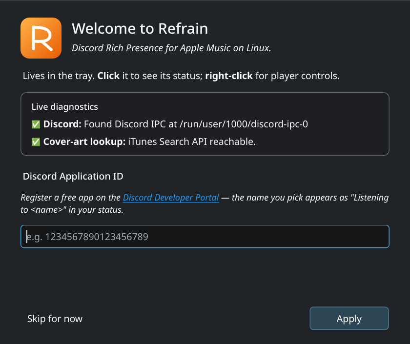
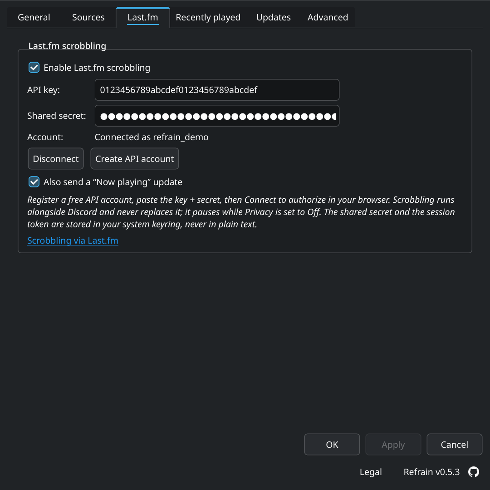
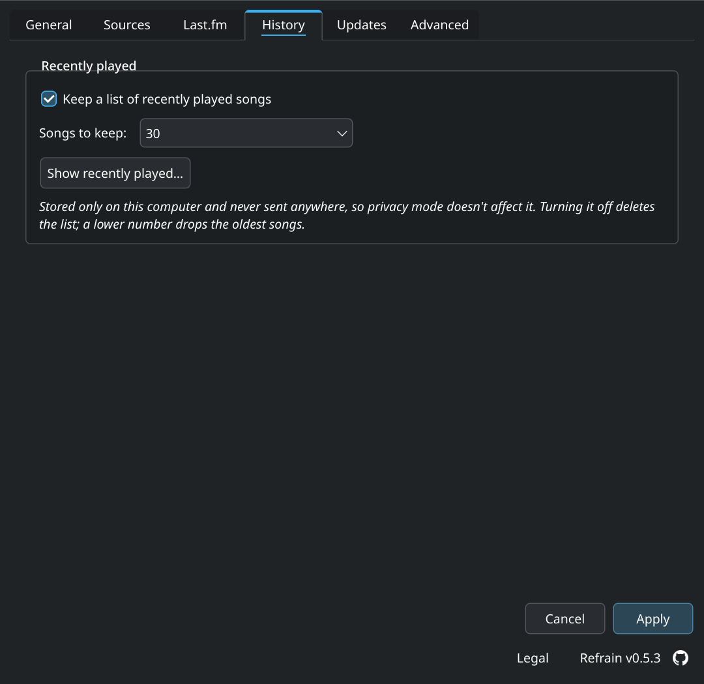
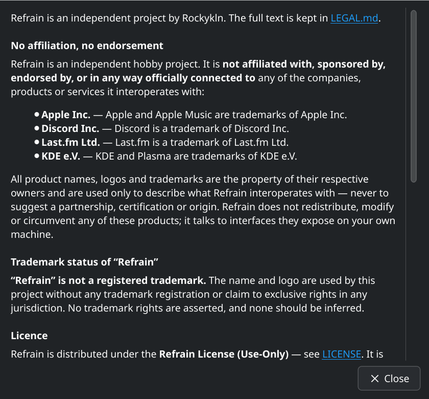
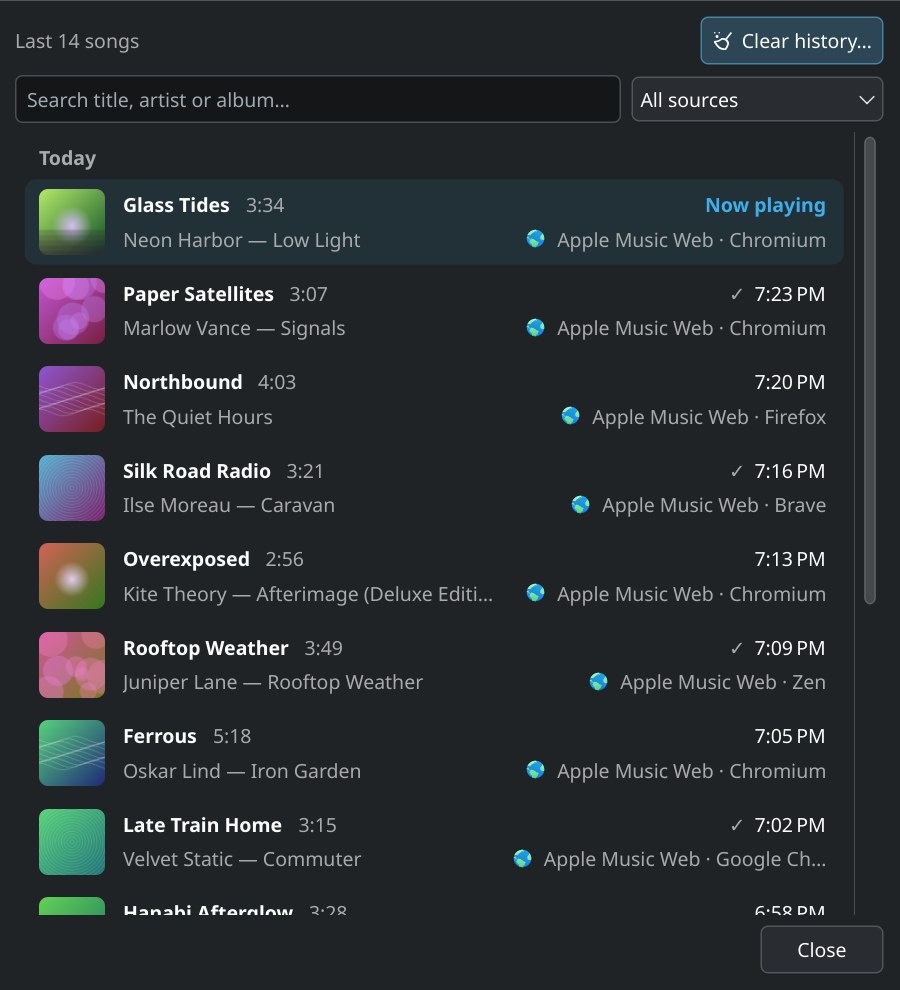

# Refrain

**Discord Rich Presence for Apple Music on Linux.**

[](https://github.com/Rockykln/refrain/actions/workflows/tests.yml)
[](https://github.com/Rockykln/refrain/actions/workflows/codeql.yml)
[](https://github.com/Rockykln/refrain/actions/workflows/security.yml)
[](#requirements)
[](LICENSE)

Refrain shows what you're listening to on Apple Music as your Discord status
— whether the audio is playing in a browser tab on `music.apple.com` or
streaming from your phone over Bluetooth.

<p align="center">
  <picture>
    <source media="(prefers-color-scheme: light)" srcset="docs/screenshots/discord-rpc-light.png"/>
    
  </picture>
</p>

## What it does

- Reads playback metadata from **MPRIS** (Apple Music in any major Linux
  browser) and **BlueZ AVRCP** (any AVRCP-capable Bluetooth source).
- Forwards track + cover art to Discord via the local IPC socket.
- Optionally **scrobbles to Last.fm** alongside Discord (opt-in, with a
  crash-safe offline queue).
- Lives in your **system tray** with Play/Pause/Next/Previous controls.
- Keeps a **recently played** list — cover, time, source — of the last
  30 songs by default, on your machine only.
- Provides a **settings window** (PySide6) for everything users typically want
  to tweak — privacy mode, sources, autostart, Bluetooth device picker.

```
        ┌─────────────────────────────────────────────────────────┐
        │   Refrain                                               │
        │                                                         │
        │   ┌──────────┐    ┌──────────┐    ┌────────────────┐    │
        │   │  MPRIS   │    │  BlueZ   │    │     Tray +     │    │
        │   │  source  │    │  AVRCP   │    │  Settings UI   │    │
        │   └────┬─────┘    └────┬─────┘    └───────┬────────┘    │
        │        │               │                  │             │
        │        ▼               ▼                  ▼             │
        │   ┌─────────────────────────────────────────────┐       │
        │   │             Background daemon               │       │
        │   └────────────────────┬────────────────────────┘       │
        │                        │                                │
        │                        ▼                                │
        │           Discord Rich Presence (IPC)                   │
        └─────────────────────────────────────────────────────────┘
```

## Requirements

- Linux with D-Bus
- **Python ≥ 3.11**
- Discord desktop client running (Refrain talks to its IPC socket)
- For Bluetooth: BlueZ with AVRCP enabled

## Install

| Channel | Install |
|---------|---------|
| **PyPI** *(any distro with Python ≥ 3.11)* | `pipx install --system-site-packages refrain` — see [below](#from-pypi) |
| **AUR** *(Arch / CachyOS / Manjaro / EndeavourOS)* | `yay -S refrain` *(stable)* or `yay -S refrain-git` *(latest main)* |
| **AppImage** *(portable single-file, any glibc-based distro)* | Returns with 0.5.3 — earlier AppImages never started and were removed |
| **From source** | See below |

The AppImage needs FUSE 2, which current distros no longer install by
default: `libfuse2t64` on Debian and Ubuntu, `fuse-libs` on Fedora,
`libfuse2` on openSUSE, `fuse2` on Arch. Without it, start the AppImage
with `--appimage-extract-and-run`.

A Flatpak manifest exists under `packaging/flatpak/` for users who want to
build it themselves; a Flathub submission is on the roadmap but not
currently active. Build files for the live channels live under
[`packaging/`](packaging/).
See [`packaging/README.md`](packaging/README.md) for build instructions.
Which versions can still be downloaded, and why the others were taken
down: [`docs/releases.md`](docs/releases.md).

### From PyPI

Current distros no longer let `pip install` into the system Python, so
install with [pipx](https://pipx.pypa.io/). dbus-python and PyGObject come
from your distro; `--system-site-packages` lets Refrain use them instead of
compiling its own:

| Distro | Command |
|--------|---------|
| Ubuntu 24.04, Linux Mint 22, Debian 13 | `sudo apt install pipx python3-dbus python3-gi` |
| Fedora 42 | `sudo dnf install pipx python3-dbus python3-gobject` |
| openSUSE Tumbleweed | `sudo zypper install python313-pipx python313-gobject gcc pkgconf dbus-1-devel glib2-devel python313-devel` |

Then:

```sh
pipx install --system-site-packages refrain
pipx ensurepath   # once, if ~/.local/bin isn't on your PATH yet
refrain --install-desktop
```

openSUSE's dbus-python package carries no metadata pip can see, so pip
builds its own copy there — hence the compiler and headers in its line.

### From source (development)

```sh
git clone https://github.com/Rockykln/refrain.git
cd refrain

# On distros that already package Qt-for-Python and dbus-python (Arch, Fedora,
# openSUSE …) a venv with --system-site-packages avoids re-downloading them.
python -m venv --system-site-packages .venv
source .venv/bin/activate

pip install -e .
refrain
```

If your distro doesn't ship `PySide6` or `dbus-python`, plain
`python -m venv .venv` works too — pip will pull `PySide6` from PyPI and
build `dbus-python`, which needs a C compiler, `pkg-config` and the D-Bus,
GLib and Python headers (`gcc pkg-config libdbus-1-dev libglib2.0-dev
python3-dev` on Debian/Ubuntu, `gcc pkgconf dbus-devel glib2-devel
python3-devel` on Fedora). Without PyGObject, Plasma's media controls
can't reach Refrain.

### Pip-installed users: get a launcher

When installed via pipx or pip rather than a distro package, Refrain
doesn't register itself with your application menu. Run once after install:

```sh
refrain --install-desktop
```

This copies the `.desktop` file and icon to `~/.local/share/applications/`
and `~/.local/share/icons/`. To undo: `refrain --uninstall-desktop`.

### Tested on

See [`docs/test-matrix.md`](docs/test-matrix.md) for the full Tier-1 / Tier-2 list, the per-row smoke checks, and which distros are explicitly out-of-scope (Python or glibc floor too low).

- **Tier 1 (must pass every release):** CachyOS, Arch Linux, Fedora 42, Ubuntu 24.04 LTS, Debian 13, openSUSE Tumbleweed, Linux Mint 22, Manjaro Stable.
- **Desktops:** KDE Plasma 6 (Wayland is the primary target, X11 also covered), GNOME with the [AppIndicator and KStatusNotifierItem](https://extensions.gnome.org/extension/615/appindicator-support/) extension, XFCE / Cinnamon / LXQt / Budgie via their native or AppIndicator-bridged tray, MATE with `mate-applet-statusnotifier`, tiling WMs (Hyprland / Sway / i3 / river) via a SNI-capable status bar.

## First-time setup

Refrain needs a Discord Application ID to push status updates. Each user
registers their own (free, takes 30 seconds):

1. Open <https://discord.com/developers/applications> and click **New Application**.
2. Name it whatever you want — that name is what shows up under
   *"Listening to ..."* in your Discord status. You can also upload a
   square image as the application icon; Discord uses it as the
   fallback when there's no album cover.
3. Copy the **Application ID** from the *General Information* page.
4. Launch Refrain → *Settings → General → Discord Client ID* → paste,
   *Apply*.

The first time you launch Refrain without a configured ID, the
welcome wizard pops up with the setup steps + a live diagnostics
panel that probes your D-Bus session and Discord IPC socket so you
know up front whether your environment can host the RPC at all.

<p align="center">
  <picture>
    <source media="(prefers-color-scheme: light)" srcset="docs/screenshots/welcome-light.png"/>
    
  </picture>
</p>

That's it. The status will appear in Discord on the next track change.

## Configuration

Settings live at `$XDG_CONFIG_HOME/refrain/config.toml`
(typically `~/.config/refrain/config.toml`). The settings window edits the
same file; you almost never need to touch it by hand.

```toml
[discord]
client_id = ""                     # default Application ID — paste yours here
client_id_mpris = ""               # optional per-source override (browser / Apple Music)
client_id_bluetooth = ""           # optional per-source override (Bluetooth headphones)
all_clients = false                # send the status to every running Discord client, not just the first
resolve_app_name = false           # opt-in: ask Discord what your Application ID is called, and show it in Settings

[sources]
mpris_enabled = true
bluetooth_enabled = true
bluetooth_device = ""              # empty = auto-detect, or "AA:BB:CC:DD:EE:FF"
browser_hints = "firefox,chromium,…"  # which MPRIS players count as a browser; edit if yours isn't detected

[privacy]
mode = "full"                      # "full" | "minimal" | "off"

[behavior]
autostart = false
notifications = true
cover_art = true
show_buttons = true
notify_delay_ms = 0                # 0 = fire ASAP; the cover-art retry loop still waits up to ~2 s

[advanced]
poll_interval_ms = 500
log_level = "INFO"
idle_grace_s = 30                  # clear status when same track plays past duration + grace; 0 disables
position_stall_s = 4               # seconds a playing track's position may stand still before Refrain stops trusting it; 0 disables
language = "system"                # "system" follows QLocale; "en", "de", "es", "fr", "pt", "it", "ru", "pl", "ja", "zh_CN" force a translation

[lastfm]
enabled = false                    # opt-in, alongside (never replacing) the Discord RPC
api_key = ""                       # register your own at last.fm/api/account/create
username = ""                      # display only
scrobble_now_playing = true        # also send the ephemeral "now playing" indicator
# NOTE: the Last.fm shared secret and session key are credentials and
# are deliberately NOT stored here. They live in your OS keyring
# (KWallet / GNOME Keyring), encrypted at rest — see "Last.fm" below.

[history]
enabled = true                     # the "Recently played" list; false also deletes what it stored
max_entries = 30                   # songs kept, 1–100 (Settings offers 10, 20, 30, 50, 75, 100)
window_width = 0                   # the history window's size when last closed; 0 = default
window_height = 0
```

Per-source `client_id_*` fields let Apple Music render under one Discord
application (with the album-grid as artwork) and Bluetooth headphones under
another (with a generic Bluetooth glyph). Empty falls back to the default
`client_id`.

## MPRIS server

Refrain publishes itself as `org.mpris.MediaPlayer2.refrain` on the session
bus, so KDE Plasma's panel media-controls applet (and KDE Connect, GNOME
Shell, Mako, …) drive the same Play/Pause/Next/Previous as the tray and
render the same track Discord renders. Plasma also offers these controls
when you right-click Refrain in the task manager, including a *Stop*
that it adds for every player — Apple Music has no stop, so there it
pauses, and does nothing when the music is already paused.

## Tray

<p align="center">
  <picture>
    <source media="(prefers-color-scheme: light)" srcset="docs/screenshots/tray-menu-light.png"/>
    
  </picture>
</p>

Every item carries a theme-matched icon (freedesktop icon names on
Plasma / GNOME / Breeze; bundled accent SVGs for Update and Quit) —
no unicode-glyph prefixes.

| Item              | What it does                                              |
|-------------------|-----------------------------------------------------------|
| Title             | Currently playing track (click opens Settings)            |
| Artist • Album    | Currently playing artist + album (hidden when idle)       |
| X:XX / Y:YY (–Z:ZZ) | Elapsed / track length / remaining (hidden when idle)   |
| Discord: connected / not connected | Live Discord-RPC connection state        |
| Discord: rejected — check Application ID | Discord accepted the socket but refused the Application ID |
| Last.fm: connected as … / session expired | Scrobbling status (hidden unless Last.fm is enabled) |
| Previous          | Skip backward on the active source                        |
| Play / Pause      | Toggle on the active source (label follows playback state)|
| Next              | Skip forward on the active source                         |
| Update available — vX.Y.Z | Only visible when a newer release exists          |
| Recently played…  | Open the history window (hidden while the history is off) |
| Settings…         | Open the settings window                                  |
| Live log…         | Open the live-log window                                  |
| Restart Refrain   | Cleanly stop and re-launch (release D-Bus name + RPC, exec the same binary) |
| Quit Refrain      | Stop the daemon and exit                                  |

Left-click the tray icon opens Settings, **middle-click toggles
play/pause**, right-click shows this menu. (DBusMenu keeps an open
menu's text static, so the progress line is a snapshot from when you
opened it — hover the tray icon for a live-updating tooltip.)

## Settings

The settings window opens on first launch, and again any time you click
*Settings…* from the tray. Hitting **Apply** writes the change to
`config.toml`, hides the window, and keeps the daemon + tray running in
the background.

<table>
  <tr>
    <td align="center">
      <b>General</b><br/>
      <picture>
        <source media="(prefers-color-scheme: light)" srcset="docs/screenshots/settings-general-light.png"/>
        
      </picture>
      <br/><sub>Discord Client ID with the application's name beside it, privacy, autostart, notifications, cover art</sub>
    </td>
    <td align="center">
      <b>Sources</b><br/>
      <picture>
        <source media="(prefers-color-scheme: light)" srcset="docs/screenshots/settings-sources-light.png"/>
        
      </picture>
      <br/><sub>MPRIS / Bluetooth toggles + paired-device picker</sub>
    </td>
  </tr>
  <tr>
    <td align="center">
      <b>Last.fm</b><br/>
      <picture>
        <source media="(prefers-color-scheme: light)" srcset="docs/screenshots/settings-lastfm-light.png"/>
        
      </picture>
      <br/><sub>Opt-in scrobbling, API key + secret, connect / disconnect an account</sub>
    </td>
    <td align="center">
      <b>History</b><br/>
      <picture>
        <source media="(prefers-color-scheme: light)" srcset="docs/screenshots/settings-history-light.png"/>
        
      </picture>
      <br/><sub>Recently played on or off, how many songs to keep</sub>
    </td>
  </tr>
  <tr>
    <td align="center">
      <b>Updates</b><br/>
      <picture>
        <source media="(prefers-color-scheme: light)" srcset="docs/screenshots/settings-updates-light.png"/>
        
      </picture>
      <br/><sub>Auto-check, last-checked, manual <i>Check for updates now</i></sub>
    </td>
    <td align="center">
      <b>Advanced</b><br/>
      <picture>
        <source media="(prefers-color-scheme: light)" srcset="docs/screenshots/settings-advanced-light.png"/>
        
      </picture>
      <br/><sub>Poll interval, notification delay, cover cache size, language, log level, restart, reset, uninstall</sub>
    </td>
  </tr>
  <tr>
    <td align="center">
      <b>Legal</b><br/>
      <picture>
        <source media="(prefers-color-scheme: light)" srcset="docs/screenshots/legal-light.png"/>
        
      </picture>
      <br/><sub>Licence, trademark and affiliation notices — the <i>Legal</i> button in the footer</sub>
    </td>
    <td></td>
  </tr>
</table>

## Recently played

<p align="center">
  <picture>
    <source media="(prefers-color-scheme: light)" srcset="docs/screenshots/history-light.png"/>
    
  </picture>
</p>

*Tray → Recently played…* lists the last songs Refrain saw — 30 by
default, up to 100 — with cover, length, when each started, where it
came from (which browser, which Bluetooth device) and whether it went to
Last.fm. A song shows up the moment it plays and stays once it counts
as listened: half its length or four minutes, the rule Last.fm uses, so
skipping through a playlist leaves nothing behind. Restarting Refrain
mid-song doesn't lose or duplicate it; a song heard through and played
again is listed twice, once per play.

- Click a song to open it in Apple Music — in the browser it played in,
  while that one is still open; a search when the song's page isn't
  known.
- Right-click to copy artist and title or to remove the song from the
  list; *Clear history…* empties it.
- From ten songs on there's a search over title, artist and album —
  blind to case and accents, found words marked — and with more than
  one source a filter by source. <kbd>Ctrl</kbd>+<kbd>F</kbd> jumps into
  the search, <kbd>Esc</kbd> clears it.
- The window opens at the size you last left it.

The list stays on your machine (`history.json`, readable only by you)
and is never sent anywhere, so the privacy mode doesn't affect it.
*Settings → History* turns it off — which deletes the file — or changes
how many songs it keeps.

## Notifications

When a track changes, Refrain fires a desktop notification with the album
cover, song title, artist and album — the same data that's going to your
Discord status. Toggle off in *Settings → General* if you don't want them.

<p align="center">
  <picture>
    <source media="(prefers-color-scheme: light)" srcset="docs/screenshots/notification-light.png"/>
    
  </picture>
</p>

## Updates

Refrain checks the [GitHub Releases API](https://api.github.com/repos/Rockykln/refrain/releases/latest)
once per day on startup. When a newer version exists, the tray menu shows
an *Update available* item that opens this dialog:

<p align="center">
  <picture>
    <source media="(prefers-color-scheme: light)" srcset="docs/screenshots/update-dialog-light.png"/>
    
  </picture>
</p>

Behavior is install-type-aware:

- **AppImage** — Refrain downloads the new `.AppImage` from the release
  assets and replaces the running binary in place (atomic rename), then
  prompts a restart.
- **pip / venv** — runs `pip install --upgrade refrain` for you.
- **Flatpak / AUR** — never modifies system files; surfaces the distro's
  own upgrade command (`flatpak update …` / `yay -Syu refrain`) so the
  package manager stays in charge.

## Last.fm scrobbling

Refrain can scrobble to [Last.fm](https://www.last.fm) **alongside** the
Discord status — a second, independent channel, never a replacement.
It's **opt-in** and off by default.

Register your own free [API account](https://www.last.fm/api/account/create),
then open the *Settings → Last.fm* tab: tick **Enable**, paste the
**API key** + **shared secret**, click **Connect…** and approve the
browser prompt. Scrobbling starts on the next track — no restart.

The **shared secret and session token are stored in your OS keyring**
(KWallet / GNOME Keyring), encrypted at rest — never in `config.toml`
(which is itself written owner-only, `0600`). On a system with no
keyring they fall back to a `0600` file. Credentials only ever leave
the machine to Last.fm over HTTPS, which is what scrobbling *is*.

A track is scrobbled once you've played at least half of it, or four
minutes (Last.fm's rule), and only if it's longer than 30 s. Scrobbles
are queued to disk the instant they qualify, so being offline, a
Last.fm outage, or quitting mid-song never loses them — they submit on
the next opportunity. Restarting Refrain mid-song carries the play on
instead of counting it again, and a song on repeat is scrobbled once per
play. Privacy mode `Off` silences scrobbling too.

Full walkthrough + troubleshooting: [`docs/lastfm.md`](docs/lastfm.md).

## Uninstalling

Refrain can wipe everything it ever wrote — on any distro, any
install method — with one command:

```sh
refrain --uninstall          # asks for confirmation; -y to skip
```

This deletes the config, logs, cover cache, scrobble queue, autostart
entry and menu entry, **and purges the Last.fm credentials from your
OS keyring**, then prints the exact command to remove the program
itself for your install type (pip / pipx / AUR / Flatpak / AppImage).
There's also a *Settings → Advanced → Uninstall Refrain…* button.

Removing just the program (keeping your settings) is the package
command for how you installed it — `pip uninstall refrain`,
`pipx uninstall refrain`, `yay -R refrain`,
`flatpak uninstall io.github.Rockykln.Refrain`, or deleting the
`.AppImage`. (`refrain --uninstall-desktop` removes only the menu
entry + icon.)

## File locations

| What          | Where                                       |
|---------------|---------------------------------------------|
| Config        | `$XDG_CONFIG_HOME/refrain/config.toml`      |
| Scrobble queue| `$XDG_STATE_HOME/refrain/scrobble_queue.jsonl` |
| Scrobble in progress | `$XDG_STATE_HOME/refrain/scrobble_current.json` |
| Recently played | `$XDG_STATE_HOME/refrain/history.json`    |
| Measured song lengths | `$XDG_STATE_HOME/refrain/song_lengths.txt` |
| Logs          | `$XDG_STATE_HOME/refrain/refrain.log` (rotates) |
| Crash stacks  | `$XDG_STATE_HOME/refrain/crash.log` (written only if Refrain crashes) |
| Cover cache   | `$XDG_CACHE_HOME/refrain/covers/` (lookups; images only for songs in *Recently played*) |
| Autostart     | `$XDG_CONFIG_HOME/autostart/refrain.desktop` (when enabled) |

## Diagnostics — live log

Tray menu → *Live log…* (or launch with `refrain --debug`) opens a
streaming view of every log line as it happens, color-coded by level and
filterable. Same content as `~/.local/state/refrain/refrain.log`, but
without tailing it from a terminal.

<p align="center">
  <picture>
    <source media="(prefers-color-scheme: light)" srcset="docs/screenshots/live-log-light.png"/>
    
  </picture>
</p>

## Privacy

Refrain is **local-first**: no Refrain server, no account, **no
telemetry**, and the author receives nothing. Two lookups are on by
default and can be switched off (cover art at Apple, the update check at
GitHub); everything else only runs once *you* set it up. Data always goes
directly to that provider:

- **Discord** — only if you set a Discord Application ID; track
  metadata goes to the *local* Discord IPC socket (the Discord client
  then broadcasts it under your account).
- **Apple iTunes Search** (HTTPS) — artist + track name, while cover art
  is enabled (the default), to fetch album art. Untick it for zero egress.
- **GitHub** (HTTPS) — a daily update check sends only the Refrain
  version + your IP. Disable in *Updates*.
- **Last.fm** (HTTPS) — opt-in scrobbling only; credentials live in
  your **OS keyring** (encrypted at rest), never in `config.toml`.

`Privacy → Off` is the global kill switch (no Discord status, no
scrobbling) while keeping the tray + controls running. The *Recently
played* list never leaves your machine, so it has its own switch in
*Settings → History* instead.

Full data-flow, retention and erasure details — written to GDPR
transparency expectations — are in [`PRIVACY.md`](PRIVACY.md).

## Documentation

- [Architecture overview](docs/architecture.md) — threads, D-Bus surface, file paths
- [FAQ](docs/faq.md)
- [Bluetooth quick-start](docs/bluetooth.md) — pair + AVRCP setup walkthrough
- [Last.fm scrobbling](docs/lastfm.md) — API account + connect walkthrough
- [Test matrix](docs/test-matrix.md) — supported distros, smoke-check checklist
- [Roadmap](docs/roadmap.md)
- [Changelog](CHANGELOG.md)
- [Contributing](CONTRIBUTING.md) — dev setup, testing, code style
- [Privacy & data protection](PRIVACY.md) — every data flow, retention, erasure
- [Security policy](SECURITY.md)
- [Packaging guide](packaging/README.md) — AUR, Flatpak, AppImage build steps
- [Releases](docs/releases.md) — every version, and why some were removed

## Contributing

See [`CONTRIBUTING.md`](CONTRIBUTING.md) for dev setup, testing, and the
source/UI architecture. PRs welcome — especially for distribution packaging
(Flatpak, AUR, AppImage) and for additional Bluetooth device shapes.

## Contact

- General questions, feedback, feature ideas → **[contact@rockykln.com](mailto:contact@rockykln.com)**
- Security reports → **[report@rockykln.com](mailto:report@rockykln.com)** (also: [GitHub private advisory](https://github.com/Rockykln/refrain/security/advisories/new))
- Bugs → please use the [issue tracker](https://github.com/Rockykln/refrain/issues)

## License

**Refrain License (Use-Only)** — see [`LICENSE`](LICENSE).

Refrain is **source-available but not open source**. In short:

- Anyone may use, copy, and redistribute the unmodified Software.
- Anyone may read, study, and reference the source code.
- Modifications and derivative works may **not** be redistributed.
  Forks on GitHub are fine only for preparing a pull request.
- The "Refrain" name and logo may not be used to imply endorsement of
  or affiliation with modified versions.

Third-party dependencies (`PySide6`, `pypresence`, `dbus-python`) retain
their original licenses (LGPL / MIT).

## Legal

Refrain is an independent project. It is **not affiliated with, sponsored
by, or endorsed by** Apple, Discord, Last.fm or KDE, and **"Refrain" is not
a registered trademark**. All product names and trademarks belong to their
respective owners and are used only to describe what Refrain interoperates
with.

Full notice — trademarks, licence, third-party components, and what data
leaves your machine — in [`LEGAL.md`](LEGAL.md). The same text is reachable
inside the app under **Settings → Legal**.

<!-- stats:start -->
## Stats

| Stat | Value |
|---|---|
| Lines of code | 9,133 |
| Lines in the repository | 43,213 |
| Words in the repository | 175,046 |
| Test coverage | 91 % |
| Words of documentation | 37,799 |
| Automated tests | 1,171 |
| Days since the first release | 136 |
| Versions released | 24 |
| Commits | 200 |
| Languages | 10 |
| Runtime dependencies | 3 |
| Browsers tested | 5 (Chrome, Chromium, Brave, Firefox, Zen) |
| Ways to install | 3 (PyPI, AUR, AppImage) |

As of v0.5.3.
<!-- stats:end -->
